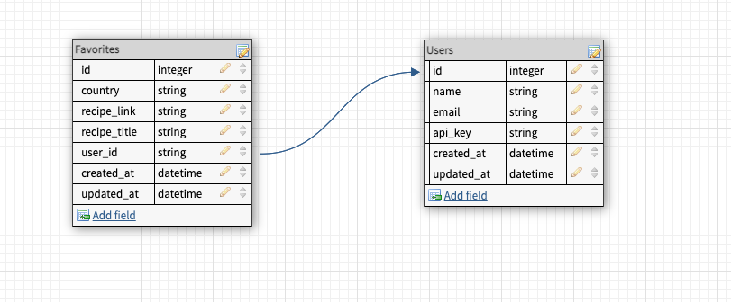

<h1 align="center">Lunch And Learn Api</h1>


<br>
 
This repo is a Back End API  solo project built during study at [Turing School of Software and Design](https://turing.edu/). 

The purpose of this Api is to expose end points relating to recipes and information of the countries of the world.

Learning Goals
<ol>- Expose an API that aggregates data from multiple external APIs</ol>
<ol>- Expose an API that requires and creates an API key</ol>
<ol>- Expose an API for CRUD functionality</ol>
<ol>- Determine completion criteria based on the needs of other developers</ol>
<ol>- Test both API consumption and exposure, making use of at least one mocking tool(VCR, Webmock, etc).</ol>
<br>


## Table of Contents
- [Database Schema](#database-schema)
- [Tech & Tools Used](#tech-and-tools)
- [Developer Setup](#setup)
- [Endpoints](#endpoints)


## Developer Setup
  If you would like to demo this API on your local machine:
<ol>
  <li> Ensure you have Ruby 2.7.4 and Rails 5.2.8 installed </li>
  <li> Fork and clone down this repo and navigate to the root folder <code>cd lunch_and_learn</code></li>
  <li> Run <code>bundle install</code> </li>
  <li><code>Run bundle exec figaro install</code></li>
  <li> Run <code>rails db:{drop,create,migrate}</code> </li>

  <li> In your `application.yml` <br>
    Assign your Edamama App Id to <code>edamam_id:</code> <br>
    Assign your Edamam App key to the variable  <code>edamam_app_key:</code><br> 
    Assign your Youtube Api Key to <code>youtube_api_key:</code><br>
    Assign your Unsplash_access_key to <code>unsplash_access_key:</code><br>
    Assign your Unsplash_secret_key to <code>unsplash_secret_key</code><br></li>

  <li> (Optional) To run the test suite, run <code>bundle exec rspec spec</code> </li>
  <li> Run <code>rails s</code> to run server</li>

You should now be able to hit the API endpoints using Postman or a similar tool.<br>
</ol>

### Other important information:
- Default host is <code>http://localhost:3000</code>

- Api keys, app id's and secrets can be created at:<br>
https://developer.edamam.com/edamam-recipe-api<br>
https://developers.google.com/youtube/v3/docs/search/list<br>
https://unsplash.com/developers

## Database-schema



## Tech and Tools
  -  **2.7.4**
  -  **5.2.8.1**
  -  **3.12.0**
  - 
 
   #### Gems Used:
  - [Pry](https://github.com/pry/pry-rails)
  - [Faraday](https://lostisland.github.io/faraday/)
  - [Figaro](https://github.com/laserlemon/figaro)
  - [Webmock](https://github.com/bblimke/webmock)
  - [VCR](https://github.com/vcr/vcr)
  - [RSpec](https://github.com/rspec/rspec-metagem)
  - [Simple-Cov](https://github.com/simplecov-ruby/simplecov)
  - [Factory Bot for Rails](https://github.com/thoughtbot/factory_bot_rails)
  - [Faker](https://github.com/faker-ruby/faker)
  - [Shoulda Matchers](https://github.com/thoughtbot/shoulda-matchers)


## Endpoints

### Request - Get recipes from a given country:
```    
GET /api/v1/recipes?country=thailand
Content-Type: application/json
Accept: application/json
```    

### Response Example:
```
{
    "data": [
        {
            "id": null,
            "type": "recipe",
            "attributes": {
                "title": "Andy Ricker's Naam Cheuam Naam Taan Piip (Palm Sugar Simple Syrup)",
                "url": "https://www.seriouseats.com/recipes/2013/11/andy-rickers-naam-cheuam-naam-taan-piip-palm-sugar-simple-syrup.html",
                "country": "thailand",
                "image": "https://edamam-product-images.s3.amazonaws.com..."
            }
        },
        {
            "id": null,
            "type": "recipe",
            "attributes": {
                "title": "Sriracha",
                "url": "http://www.jamieoliver.com/recipes/vegetables-recipes/sriracha/",
                "country": "thailand",
                "image": "https://edamam-product-images.s3.amazonaws.com/."
            }
        },
        {...},
        {...},
        {...},
        {etc},
    ]
}
```
### Response when no recipes returned:
 ```    
{
  "data": []
}
 ```    

### Request get learning resources from a given country:
 ```    
GET /api/v1/learning_resources?country=laos
Content-Type: application/json
Accept: application/json
 ```    
### Response Example:
```    
    {
        "data": {
            "id": null,
            "type": "learning_resource",
            "attributes": {
                "country": "laos",
                "video": {
                    "title": "A Super Quick History of Laos",
                    "youtube_video_id": "uw8hjVqxMXw"
                },
                "images": [
                    {
                        "alt_tag": "standing statue and temples landmark during daytime",
                        "url": "https://images.unsplash.com/photo-1528181304800-259b08848526?ixid=MnwzNzg2NzV8MHwxfHNlYXJjaHwxfHx0aGFpbGFuZHxlbnwwfHx8fDE2Njc4Njk1NTA&ixlib=rb-4.0.3"
                    },
                    {
                        "alt_tag": "five brown wooden boats",
                        "url": "https://images.unsplash.com/photo-1552465011-b4e21bf6e79a?ixid=MnwzNzg2NzV8MHwxfHNlYXJjaHwyfHx0aGFpbGFuZHxlbnwwfHx8fDE2Njc4Njk1NTA&ixlib=rb-4.0.3"
                    },
                    {
                        "alt_tag": "orange temples during daytime",
                        "url": "https://images.unsplash.com/photo-1563492065599-3520f775eeed?ixid=MnwzNzg2NzV8MHwxfHNlYXJjaHwzfHx0aGFpbGFuZHxlbnwwfHx8fDE2Njc4Njk1NTA&ixlib=rb-4.0.3"
                    },
                    {...},
                    {...},
                    {...},
                    {etc},
                ]
            }
        }
    }
 ```    

### Response when no learning_resource is returned:
 ```    
{
  "data": {
      "id": null,
      "type": "learning_resource",
      "attributes": {
          "country": "Nameofcountry", # this value is the value used to search for learning resources
          "video": {},
          "images": []
      }
  }
} 
```    

### Request create a new user and api_key is created:
 ```    
POST /api/v1/users
Content-Type: application/json
Accept: application/json
 ```    
### Response Example:
 ```    
{
  "name": "Athena Dao",
  "email": "athenadao@bestgirlever.com"
}
 ```    


 ```    
    {
    "data": {
        "type": "user",
        "id": "1",
        "attributes": {
        "name": "Athena Dao",
        "email": "athenadao@bestgirlever.com",
        "api_key": "jgn983hy48thw9begh98h4539h4"
        }
      }
    }
 ```    


### Request Add a new favorite recipe to a user:
 ```    
    POST /api/v1/favorites
    Content-Type: application/json
    Accept: application/json
 ```    
### JSON payload example for a request:
 ```    
    {
        "api_key": "jgn983hy48thw9begh98h4539h4",
        "country": "thailand",
        "recipe_link": "https://www.tastingtable.com/.....",
        "recipe_title": "Crab Fried Rice (Khaao Pad Bpu)"
    }
```    
### Response example:
```    
    {
        "success": "Favorite added successfully"
    }
```    

### Request Get all favorites of a user:
 ```    
GET /api/v1/favorites?api_key=jgn983hy48thw9begh98h4539h4
Content-Type: application/json
Accept: application/json
 ```    
### Response Example:
 ```    
    {
        "data": [
            {
                "id": "1",
                "type": "favorite",
                "attributes": {
                    "recipe_title": "Recipe: Egyptian Tomato Soup",
                    "recipe_link": "http://www.thekitchn.com/recipe-egyptian-tomato-soup-weeknight....",
                    "country": "egypt",
                    "created_at": "2022-11-02T02:17:54.111Z"
                }
            },
            {
                "id": "2",
                "type": "favorite",
                "attributes": {
                    "recipe_title": "Crab Fried Rice (Khaao Pad Bpu)",
                    "recipe_link": "https://www.tastingtable.com/.....",
                    "country": "thailand",
                    "created_at": "2022-11-07T03:44:08.917Z"
                }
            }
        ]
    }
 ```    


